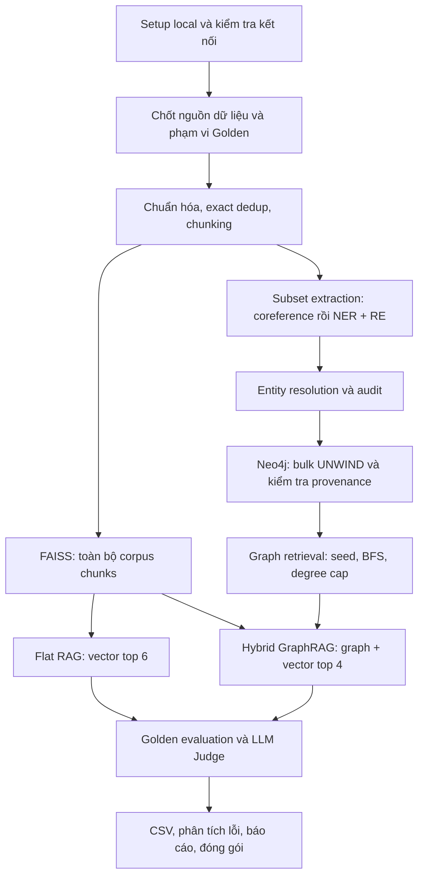

# Workflow thực hiện Lab 19: GraphRAG vs Flat RAG

Workflow này bám theo [README.md](README.md), [ASSIGNMENT.md](ASSIGNMENT.md), [RUBRIC.md](RUBRIC.md) và các section trong [notebook chính](Day19_GraphRAG_vs_FlatRAG_Production_Lab_Guide.ipynb). Môi trường thực hiện: Windows PowerShell, `.venv`, JupyterLab và Neo4j 5 chạy bằng Docker.

## 1. Kết quả cần đạt và trạng thái ban đầu

Xây dựng hai pipeline trả lời trên cùng tập tin tức, đánh giá bằng cùng bộ câu hỏi và lưu bằng chứng đủ để giải thích kết quả. Không đặt trước kết luận GraphRAG phải thắng Flat RAG.

| Hạng mục | Trạng thái khi lập workflow | Việc tiếp theo |
|---|---|---|
| Python `.venv` và JupyterLab | Đã kiểm tra Python, JupyterLab và kernel hoạt động | Mở notebook bằng Python trong `.venv` |
| Neo4j Docker | Theo output người dùng, `neo4j-drug-kg` đang Up, có cổng 7474/7687 | Kiểm tra kết nối bằng driver và xác định dữ liệu đang có |
| Notebook | Có code khung; nhiều lời gọi hàm đang bị comment; đường dẫn mặc định là `/content/...` | Chuẩn bị cấu hình local và bổ sung thứ tự thực thi |
| Dữ liệu tin tức | Chưa thấy `hackernoon_subset.csv` trong repo | Lấy đúng bản dump hoặc stream subset có ghi nhận nguồn |
| Golden Dataset | Hai CSV mang tên `golden_50` thực tế đều có 25 câu; bản detailed có 2 factoid, 12 multi-hop, 11 cross-doc | Đối chiếu bằng chứng với corpus trước khi chọn câu đánh giá |
| Benchmark và báo cáo | `outputs/` chưa có kết quả; `reports/lab_report.md` là template | Chỉ điền số liệu sau khi chạy thực tế |

## 2. Luồng xử lý và nguyên tắc thực nghiệm



- Giữ scale guard: `LAB_MAX_ARTICLES=1500`, `LAB_MAX_CHUNKS=3000`, `EXTRACTION_MAX_CHUNKS=400`; chunk 220 từ, overlap 40 từ.
- Lần chạy Free Tier chốt `LAB_EXTRACTION_CHUNKS=200`, batch coreference/extraction = 8 và reasoning = low trước benchmark. Corpus dùng title + description theo schema HackerNoon; báo cáo phân biệt nguồn khớp metadata với thông tin thực sự có trong snippet.
- Cùng corpus, embedding, generator, system prompt và cấu hình sinh câu trả lời. Cố định seed 42, danh sách câu hỏi và subset extraction trước benchmark cuối.
- Baseline theo notebook: Flat lấy 6 chunks; Hybrid lấy graph context cộng 4 chunks. Báo cáo rõ khác biệt này và việc graph chỉ được trích xuất từ tối đa 400 chunks.
- `reference_answer`, `gold_reasoning` và `scoring_notes` chỉ phục vụ đánh giá; không đưa chúng vào corpus, graph hoặc prompt sinh câu trả lời.
- Lưu log, cấu hình và kết quả trung gian để truy vết; một lần chạy lỗi phải được ghi nhận, không biến thành kết quả đạt.

## 3. Các bước thực hiện và điều kiện chuyển bước

### W0 — Chuẩn bị môi trường local

**Thực hiện:**

1. Mở notebook từ đúng thư mục repo:

   ```powershell
   .\.venv\Scripts\python.exe -m jupyterlab Day19_GraphRAG_vs_FlatRAG_Production_Lab_Guide.ipynb
   ```

2. Nếu dựng lại môi trường, cài `requirements.txt`; JupyterLab và ipykernel đã được bổ sung vào file này.
3. Tạo `.env` từ `.env.example` nếu chưa có; điền secrets ở local. Dùng `NEO4J_URI=bolt://localhost:7687`, user/database phù hợp và mật khẩu thực của container. Dùng Groq cho cả pipeline và Judge (`JUDGE_PROVIDER=groq`, `JUDGE_MODEL` là model Groq truy cập được); chỉ cần `GROQ_API_KEY` cho hai vai trò. `HF_TOKEN` phục vụ tải dataset. Gemini/OpenAI là lựa chọn bổ sung nếu muốn dùng Judge khác.
4. Trong cell Imports & config, gọi `load_dotenv()` trước các lần `get_secret()`. Code khung hiện đọc environment nhưng chưa tự nạp `.env`.
5. Chuyển `DATA_PATH`, `OUTPUT_CSV`, `GOLDEN_PATH`, `CHECKPOINT` và các lệnh export từ `/content/...` sang đường dẫn trong repo; tạo thư mục đích trước khi ghi. Chốt:
   - corpus: `data/hackernoon_subset.csv`;
   - Golden đang chạy: `data/graphrag_golden_lab.csv`;
   - checkpoint và kết quả: `outputs/`.
6. Chạy imports, `connect_neo4j()`, `RETURN 1 AS ok` và `setup_graph_schema()`. Kiểm tra schema/dữ liệu hiện có; tên container không xác định schema của bài lab. Nếu có graph từ bài khác, chọn môi trường lab riêng hoặc namespace trước ingestion, tránh trộn kết quả. Không xóa toàn bộ database để giải quyết việc này.
7. Thử một request nhỏ cho Groq và Judge; chỉ in trạng thái, không in secret.

**Đạt khi:** kernel dùng Python trong `.venv`, imports thành công, Neo4j trả kết quả, secrets được nạp và cả hai vai trò LLM gọi được. Trạng thái container Up chưa thay thế kiểm tra driver.

### W1 — Chốt corpus và Golden trước khi xử lý

**Thực hiện:**

1. Bản Golden detailed ghi nguồn là **5.000 dòng đầu của `hackernoon_subset.csv`**. Ưu tiên lấy đúng bản dump đó. Nếu stream lại, không mặc định row index khớp bản gốc; đối chiếu URL, title và ngày xuất bản.
2. Lưu ánh xạ `source_row_id` gốc sang `article_id`, rồi sang `chunk_id`. Giữ ánh xạ khi lọc, dedup và sample; bài trùng có thể cùng trỏ về bản canonical còn giữ.
3. Chọn ít nhất 5 câu đã kiểm chứng, đủ ba nhóm; gợi ý vòng đầu: 1 factoid + 2 multi-hop + 2 cross-doc. Giữ nguyên ID và reference có nguồn. Muốn chạy cả 25 câu, phải xác minh độ phủ và ngân sách trước.
4. Lập bảng coverage cho từng câu: bằng chứng có trong corpus không, có trong vector chunks không, có trong extraction subset không. Golden ngoài corpus phải được tách thành tập kiểm tra thiếu bằng chứng và báo cáo riêng.
5. Chốt cách sample: code khung hiện random 1.500 bài rồi lấy tối đa 3.000 chunks và `head(400)` cho extraction, nên có thể mất nguồn Golden. Nếu chủ động chọn nguồn theo evidence IDs để tạo bài demo có độ phủ, công bố đây là sample được tuyển chọn; không suy rộng kết quả thành benchmark ngẫu nhiên.
6. Một số Golden cần relation ngoài allowlist, hoặc 3–4 hops. Giữ schema và BFS 2 hops cho baseline; ghi nhận giới hạn và để vector context bổ sung bằng chứng. Không đổi một quan hệ "đang cân nhắc" thành `USES` đã xác nhận.

**Đầu ra:** `data/graphrag_golden_lab.csv`, bảng coverage và manifest ghi corpus/subset được chọn. Không truyền đáp án chuẩn vào retrieval.

**Đạt khi:** ít nhất 5 câu đủ ba nhóm có reference đã đối chiếu với nguồn thật; phạm vi corpus và graph được ghi rõ. File CSV tên "50" không được báo cáo thành 50 câu.

### W2 — Tiền xử lý và coreference

**Hàm/cell:** `load_news()`, `standardize_news()`, `build_chunks()`, `run_coref()` — notebook Phần 1.

**Thực hiện:**

1. Load corpus, kiểm tra cột text/title/date/id. Chuẩn hóa NFKC và khoảng trắng; exact dedup bằng hash title + text. Code khung cần được đối chiếu để bảo đảm NFKC áp dụng cho văn bản đầu vào.
2. Chia chunk với ID ổn định và metadata nguồn. Ghi số bài trước/sau dedup, số chunks và số ngày thiếu/không parse được.
3. Chọn tối đa 400 chunks extraction theo manifest; lần chạy cuối dùng 200 chunks, coreference batch 8 theo `.env`. Giữ cả `text` gốc, `resolved_text` và `unresolved_mentions`.
4. Spot-check ít nhất 5 chunks có đại từ hoặc nhiều thực thể. Đại từ mơ hồ giữ nguyên; log `COREF_BATCH_FAILED` phải được xem xét. Không coi prompt bảo thủ là bằng chứng mô hình luôn làm đúng.
5. Lưu checkpoint coreference để việc mở lại notebook không buộc gọi LLM lại từ đầu.

**Đầu ra gợi ý:** `outputs/preprocessing_stats.csv`, `outputs/chunk_manifest.csv`, `outputs/coref_audit.csv` và checkpoint chứa nội dung để tái sử dụng ở local.

**Đạt khi:** DataFrames không rỗng; ID không trùng; caps đúng; có bằng chứng kiểm tra coreference và ghi nhận các trường hợp không giải được.

### W3 — Trích xuất, entity resolution và Neo4j ingestion

**Hàm/cell:** `run_extraction()`, `build_resolution_map()`, `canonicalize_triples()`, `build_nodes()`, `bulk_insert_nodes()`, `bulk_insert_edges()`, `graph_checks()` — notebook Phần 2.

**Thực hiện theo thứ tự:**

1. Chạy extraction batch theo `.env` (lần cuối là 8); kiểm tra JSON và kiểu dữ liệu trước khi chấp nhận triple. Nodes chỉ gồm `Company`, `Person`, `Technology`; relations chỉ gồm 8 loại trong `ALLOWED_RELATIONS`.
2. Kiểm tra `source_chunk_id` tồn tại; `evidence` truy được về văn bản gốc; `confidence` nằm trong [0, 1]. Ngày lấy từ metadata nguồn. Nếu ngày không có, ghi nhận/reject theo policy; không tự tạo một ngày để qua kiểm tra.
3. Chạy entity resolution: alias thủ công → embedding candidates cùng loại → cosine threshold 0.90 → lexical guard → Union-Find. Guard khởi điểm dùng tỷ lệ 0.72; cần thêm kiểm tra người khác tên và sản phẩm chứa tên công ty.
4. Audit cả merge và reject. Đọc ít nhất 10 dòng thực tế; giải thích các trường hợp `MERGE_MANUAL`, `MERGE_VECTOR`, `REJECT_GUARD` nếu chúng xuất hiện. Nếu audit ít, tăng phạm vi kiểm tra có giới hạn; không tạo log giả để đủ số dòng. Ví dụ test chủ động phải được ghi là dữ liệu test.
5. Canonicalize, tạo nodes rồi bulk insert bằng `UNWIND`, batch 1.000. Tạo unique constraint `Entity.id` và index `name_norm`. Kiểm tra chạy lại không nhân đôi cùng một edge/source.
6. Chạy `graph_checks()`, lưu counts và top-degree nodes. Bổ sung kiểm tra chuỗi rỗng cho chunk/date vì check `IS NULL` hiện tại không bắt được `""`.

**Đầu ra gợi ý:** `outputs/extraction_errors.csv`, `outputs/entity_resolution_audit.csv`, `outputs/graph_sanity.csv`, `outputs/top_degree_entities.csv` và checkpoint triples local.

**Đạt khi:** graph có nodes/edges thuộc lab; schema đúng; 0 edge thiếu provenance, kể cả giá trị rỗng; audit minh bạch ít nhất 10 dòng; có top 3 degree thực đo.

### W4 — Xây hai pipeline retrieval và kiểm tra failure modes

**Hàm/cell:** `build_flat_index()`, `build_entity_matcher()`, `match_seeds()`, `retrieve_graph_context()`, `answer_flat_rag()`, `answer_graph_rag()` — notebook Phần 3 và 5.1.

**Thực hiện:**

1. Build Flat FAISS `IndexFlatIP` từ chunks; normalize embedding, giữ đúng ánh xạ index → chunk. Flat retrieve top 6.
2. Build entity matcher từ canonical nodes. Seed exact match theo tên/aliases; fallback vector threshold 0.66.
3. Graph BFS tối đa 2 hops, degree >100 chỉ lấy tối đa 50 cạnh mới nhất, tổng cạnh ≤250, graph context ≤14.000 ký tự. Textualization giữ direction, date, chunk và evidence.
4. Hybrid nối `=== GRAPH ===` với `=== VECTOR ===` top 4. Cả hai generator dùng cùng model/prompt và trích dẫn chunk; thiếu evidence thì nói rõ.
5. Thử một câu mỗi nhóm; lưu retrieved chunk IDs, matched seeds, collected edges, cap events và context thực gửi vào generator.
6. Kiểm tra trực tiếp các nhánh quan trọng: không tìm được seed; seed sai; false merge; cap làm mất cạnh lịch sử. Nếu graph thực không có node degree >100, ghi nhận "chưa kích hoạt trong dữ liệu thật" và kiểm tra nhánh >100 bằng fixture tách biệt. `test_supernode_policy()` trên node degree thấp chưa chứng minh nhánh này đúng.

**Đạt khi:** hai hàm answer sinh kết quả trên cùng câu hỏi; nguồn được truy vết; caps được kiểm tra, bao gồm fixture nếu cần; lỗi/missing evidence được ghi nhận rõ.

### W5 — Golden evaluation và benchmark

**Hàm/cell:** `validate_golden()`, `judge_answer()`, `run_evaluation()`, `comparison_table()` — notebook Phần 4.

**Thực hiện:**

1. Validate schema Golden, ID duy nhất, reference không rỗng và đủ ba nhóm. Chạy thử 1 câu để kiểm tra đường đi answer → Judge → checkpoint.
2. Chốt prompt/model/threshold/corpus/Golden IDs rồi chạy toàn bộ tập đã chọn. Mỗi câu có hai answers, ba điểm Judge 1–5 cho mỗi answer và rationale.
3. Đo **latency toàn bộ lượt trả lời** từ trước retrieval đến sau generation. Code khung `latency_s` hiện chỉ đo generation; cần tách `retrieval_latency_s`, `generation_latency_s` và `end_to_end_latency_s`, hoặc ghi rõ giới hạn nếu chưa bổ sung.
4. Token code khung chỉ lấy từ generator. Bổ sung token seed extraction cho online GraphRAG; tách token/chi phí indexing và Judge khỏi chi phí một lượt trả lời. Usage không có thì đánh dấu thiếu, không thay bằng 0.
5. Giữ context Judge đầy đủ hoặc ghi lại phần bị cắt: code hiện cắt candidate context ở 18.000 ký tự. Ghi nhận ảnh hưởng khi Judge không thấy toàn bộ bằng chứng generator đã dùng.
6. Checkpoint sau mỗi câu và hỗ trợ resume theo query ID + cấu hình/corpus tương ứng. Runner hiện ghi checkpoint nhưng chưa đọc để resume. Ghi số câu thành công/thất bại và thời gian chạy; không im lặng bỏ câu lỗi.
7. Export hai CSV bắt buộc, tính trung bình theo nhóm và tổng thể, kèm số mẫu và chênh lệch GraphRAG − Flat. Lưu manifest: model IDs, prompt version, thresholds, caps, seed, dataset fingerprint, sample IDs, thời gian đo.

**Đầu ra bắt buộc:**

- `outputs/graphrag_eval_results.csv`;
- `outputs/graphrag_vs_flatrag_summary.csv`.

**Đầu ra phục vụ truy vết:** `outputs/graphrag_eval_checkpoint.csv`, `outputs/run_manifest.json`, `outputs/retrieval_trace.jsonl` hoặc định dạng tương đương ở local.

**Đạt khi:** đủ số câu đã chốt; cả hai phương pháp được chấm; điểm/rationale hợp lệ; CSV mở đọc lại được; định nghĩa latency/token đúng với số liệu được báo cáo.

### W6 — Phân tích lỗi, viết báo cáo và đóng gói

1. Chọn tối thiểu hai ca thực tế: một ca Flat mất thông tin/nối quan hệ và một ca GraphRAG gặp khó. Nếu không tìm thấy ca GraphRAG thắng, báo cáo kết quả thực đo và giải thích; không sửa số liệu cho khớp kỳ vọng đề bài.
2. Với mỗi ca, truy vết: query → retrieved context → triples/seeds/cap → answer → Judge rationale → nguyên nhân gốc → cách sửa → kết quả kiểm tra lại nếu đã sửa. Phân biệt thiếu dữ liệu, extraction sai, retrieval sai và generation sai.
3. Điền `reports/lab_report.md` với 10 câu bảo vệ kiến trúc theo mục 5.2 của notebook: coreference, threshold, false merge, top degree, ưu tiên ngày mới, nhóm Flat thắng, nhóm Graph thắng, latency/token, quyết định về AI Agent và scale 350MB. Thêm mapping bài giảng, bài học debug và Action Plan cá nhân.
4. Tài liệu nộp bài chưa thống nhất: README/template yêu cầu báo cáo gộp, RUBRIC yêu cầu ba file. Dùng `lab_report.md` làm bản gốc và khi đóng gói xuất đúng phần tương ứng sang `technical_defense.md`, `failure_analysis.md`, `reflection_VuDuyDiep.md`; bảo đảm nội dung đồng bộ.
5. CSV chuẩn đặt ở `outputs/` theo README và quy trình cuối RUBRIC. Riêng tiêu chí 3.3 ghi `reports/`; khi đóng gói có thể tạo bản sao của hai CSV đã kiểm chứng vào `reports/` để bao phủ mục này.
6. Chạy Restart & Run All theo thứ tự; các cell orchestration phải thực sự gọi hàm. Dùng checkpoint có kiểm tra fingerprint để hạn chế gọi LLM lại. Kiểm tra rerun ingestion không làm thay đổi counts ngoài dự kiến.
7. Kiểm tra Git chỉ có artifacts cần nộp, không có secrets/raw dump lớn. `.gitignore` hiện bỏ qua `golden_dataset.csv`; tên `graphrag_golden_lab.csv` ở trên tránh bỏ sót Golden đã chọn. Kiểm tra notebook outputs cũng không chứa secret.
8. Commit và push khi chuyển sang thực hiện bước nộp bài; kiểm tra artifacts trên repo remote. Việc lập workflow chưa thực hiện commit/push hay tạo kết quả benchmark.

**Đạt khi:** notebook chạy lại thành công với môi trường đã cấu hình; hai CSV và báo cáo đủ nội dung; số liệu có nguồn và bằng chứng; bộ bài nộp được kiểm tra.

## 4. Thứ tự chạy các hàm khi triển khai notebook

Các bước dưới đây là bản đồ thứ tự thực thi, không phải script có thể dán chạy nguyên khối:

```text
imports/config + load_dotenv + local paths
  → connect_neo4j → setup_graph_schema
  → load_news → standardize_news → build_chunks
  → freeze extraction_source → run_coref → merge theo chunk_id
  → run_extraction
  → build_resolution_map → canonicalize_triples → build_nodes
  → bulk_insert_nodes → bulk_insert_edges → graph_checks
  → build_flat_index → build_entity_matcher
  → smoke answers + test_supernode_policy + show_resolution_audit
  → load Golden → validate_golden → run_evaluation
  → comparison_table → export → failure analysis → reports
```

## 5. Phân bổ thời gian và đối chiếu thang điểm

Setup W0 và chọn nguồn W1 nên được chuẩn bị trước phiên thực hành. Thời gian tải model, rate limit và số request có thể kéo dài; 120 phút là timebox của đề bài, không phải bảo đảm thời gian hoàn thành trên mọi máy.

| Timebox thực hành | Nội dung | Bằng chứng cần giữ | Điểm tương ứng trong RUBRIC |
|---|---|---|---|
| 00–15 phút | W2: preprocessing và coreference | Counts, chunks, coref spot-check | 1.1: 8đ |
| 15–45 phút | W3: extraction, resolution, ingestion | Triples, UNWIND, audit, provenance | 1.2 + 1.3: 20đ; 2.2 + 2.3: 12đ |
| 45–75 phút | W4: Flat và Hybrid retrieval | Hai answers, traces, cap checks | 1.4: 12đ; 2.1: 8đ |
| 75–105 phút | W5: Golden và benchmark | Golden verified, Judge, hai CSV | 3.1–3.3: 20đ |
| 105–120 phút | W6: chọn ca lỗi, export, kiểm tra rerun | Hai ca truy vết, artifacts | Chuẩn bị phần báo cáo |
| 120–150 phút | Hoàn thiện báo cáo và reflection | 10 câu, hai ca lỗi, mapping/action plan | 4.1–4.3: 20đ |

Ưu tiên hoàn thành 100 điểm cơ bản trước bonus. Chỉ làm bonus khi còn ngân sách: self-correction (+5), community reports/global search (+5), near-dedup (+3); tổng bonus tối đa +10. Community ID đơn thuần chưa đủ yêu cầu global search; cần reports và truy vấn. Mọi bonus phải có kiểm tra và so sánh trước/sau.

**Nguồn điểm chuẩn là `RUBRIC.md`: 40/20/20/20.** Section cuối notebook ghi 30/30/20/20; workflow dùng thang điểm của RUBRIC theo yêu cầu bám tài liệu chấm điểm.

## 6. Checklist sử dụng trong lúc làm

- [x] W0: local config, kernel, driver và LLM preflight đạt.
- [x] W1: chốt corpus, Golden, coverage và manifest.
- [x] W2: dedup/chunk/coref có counts và audit thực tế; spot-check 5 chunks.
- [x] W3: schema đúng, bulk UNWIND, 282 audit rows, 0 cạnh thiếu provenance.
- [x] W4: hai pipelines chạy; seed/BFS/caps được kiểm tra và có traces.
- [x] W5: 5 câu đủ ba nhóm, Judge đầy đủ, latency/token được định nghĩa rõ.
- [x] Hai CSV bắt buộc được export và đọc lại thành công.
- [x] W6: báo cáo đủ 10 câu, hai ca lỗi, reflection và Action Plan đề xuất.
- [x] Restart & Run All: 22 code cells, 0 errors, 0 PENDING.

Trạng thái kiểm tra artifacts và Git được ghi trong `outputs/final_validation.json` và lịch sử commit; gửi link repo cho giảng viên do học viên thực hiện.

**Sau benchmark:** đọc `reports/failure_analysis.md` trước khi diễn giải điểm Judge; kế hoạch đồ án hiện là ví dụ trợ lý học tập, chưa khẳng định đã có dự án cá nhân được triển khai.

## 7. Tiến độ triển khai ngày 05/10/2026

Đã chạy corpus HackerNoon thật: stream 5.000 rows, chuẩn hóa 2.695, exact-dedup còn 2.119, chọn 1.500 bài/chunks cho vector và 200 chunks cho extraction. Graph của namespace cuối có 97 nodes/52 edges. 40 tests pass; notebook 22 code cells/0 errors/0 PENDING. Raw Judge cuối chấm hai phương pháp 5/5; review vẫn phát hiện số tổng chưa đủ evidence và graph NO_SEED được vector cứu. Không có kết luận GraphRAG vượt Flat RAG trên sample này. Graph thật max degree 3; fixture riêng kiểm tra 120 → 50 cạnh mới nhất.

Chi tiết và lệnh chạy tiếp: [reports/execution_status.md](reports/execution_status.md).
