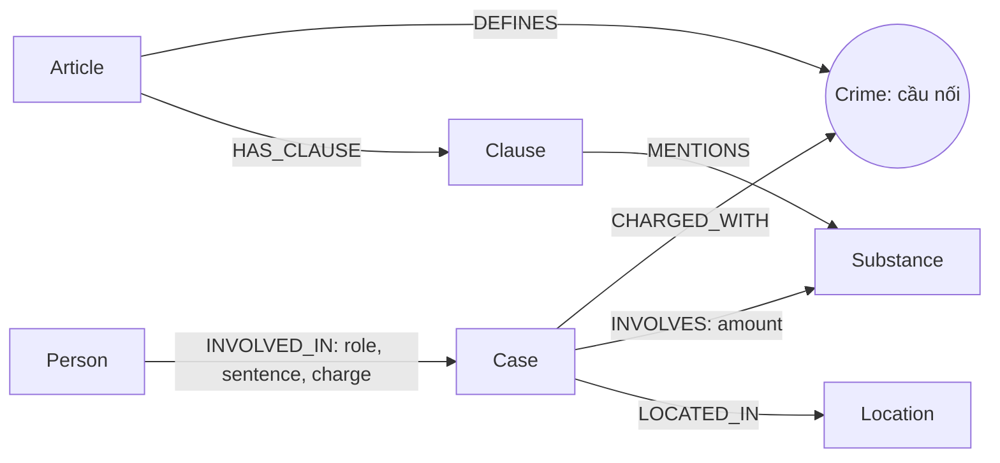

# Thiết kế Ontology — Day 19

**Họ tên:** Vũ Duy Điệp · **MSSV:** 2A202602703

- [x] Dùng ontology gợi ý, có điều chỉnh truy hồi.
- [ ] Tự thiết kế để xét bonus.

## 1. Sơ đồ

`Crime` là node cầu nối giữa tin tức và luật.

## 2. Entity types

| Label | Ý nghĩa | Khóa MERGE | Properties | KB | Trích xuất |
| --- | --- | --- | --- | --- | --- |
| Article | Một Điều luật | id | id, title, law, doc_id | Luật | Regex và metadata |
| Clause | Một khoản của Điều | id | id, number, penalty, text, doc_id | Luật | Regex |
| Crime | Tội danh chuẩn | name | name | Luật, tin | Tiêu đề luật; LLM và link_entity |
| Case | Vụ việc | name | name, summary, date, doc_id, source_title | Tin | LLM |
| Person | Người trong vụ | name | name, aliases | Tin | LLM |
| Substance | Chất liên quan | name | name | Luật, tin | Danh sách từ khóa / LLM |
| Location | Địa điểm | name | name | Tin | LLM |

Article, Clause và Case mang `doc_id` của tài liệu nguồn. Crime, Substance, Person và Location dùng chung giữa các tài liệu nên không đặt một `doc_id` đơn lẻ gây hiểu nhầm nguồn. Nguồn của các node này truy ngược qua Case hoặc Article/Clause.

## 3. Relationships

| Type | Từ → Đến | Properties | Ý nghĩa |
| --- | --- | --- | --- |
| DEFINES | Article → Crime | — | Điều luật quy định tội danh |
| HAS_CLAUSE | Article → Clause | — | Điều gồm các khoản |
| MENTIONS | Clause → Substance | — | Khoản nhắc đến chất |
| CHARGED_WITH | Case → Crime | — | Tội danh của vụ |
| INVOLVES | Case → Substance | amount | Chất và khối lượng trong vụ |
| LOCATED_IN | Case → Location | — | Địa điểm của vụ |
| INVOLVED_IN | Person → Case | role, sentence, charge | Vai trò, mức án, tội danh của từng người |

## 4. Node cầu nối giữa 2 KB

Chọn Crime vì tin mô tả hành vi/tội danh, còn luật định nghĩa tội tương ứng. Chuẩn hóa khoảng trắng, chữ thường, bỏ tiền tố “Tội”; `link_entity` khớp chính xác trước, sau đó fuzzy với cutoff 0.8 và trả lại cách viết chuẩn trong luật. Prompt trích tin nhận danh sách tội từ các tiêu đề Điều luật.

Cầu nối gãy khi tin chưa xác định tội, LLM bỏ sót tội, hoặc tội không có trong KB luật. Không nối một tên không đủ giống. Khi thiếu cầu nối, agent còn các chunk vector; cần kiểm tra vụ không có CHARGED_WITH bằng Cypher, đối chiếu bài gốc và cập nhật prompt/KB thay vì suy đoán tội.

## 5. Competency questions

| Câu | Đường đi | Khả năng và giới hạn |
| --- | --- | --- |
| Q1 | Article(PCMT Điều 2) → HAS_CLAUSE → Clause | Khi câu hỏi nhắc Luật Phòng, chống ma túy, lấy các khoản của KB luật PCMT để có định nghĩa; không cần Crime. |
| Q2 | Person → INVOLVED_IN(sentence) → Case(vụ 36 kg) | Seed thêm vụ có khối lượng xuất hiện trong tên/tóm tắt (chuẩn hóa khoảng trắng); lấy những người có mức án tử hình. Có thể nhầm khi nhiều vụ có cùng khối lượng. |
| Q3 | Person(Lê Minh Thành) → Case → Crime ← Article(251) → Clause(1) | Ghép mức án thực tế với tội, Điều và khung cơ bản. |
| Q4 | Person(name/aliases Hoàng Nato) → Case → Crime ← Article(255) → Clause | Câu hỏi “tối đa/cao nhất” lấy toàn bộ khoản, tránh mất khoản 4 khi vụ không có chất cụ thể. |
| Q5 | Person(Cái Quang Huy) → Case → INVOLVES → Substance(MDMA); Case → Crime ← Article(250) → Clause → MENTIONS → Substance | Đưa các khoản nhắc MDMA cho LLM đọc ngưỡng. Chưa có phép so sánh khối lượng số trong graph nên chưa tự xác định khoản bằng Cypher. |
| Q6 | Substance(MDMA) ← INVOLVES ← Case ← INVOLVED_IN ← Person | Mở rộng từ chất sang nhiều vụ. Tính đầy đủ phụ thuộc corpus, trích xuất và max_facts. |

## 6. Quyết định thiết kế và đánh đổi

1. **Regex cho luật, LLM cho tin:** luật có cấu trúc Điều/khoản đều, trích bằng regex không tốn chat token. Dùng LLM cho cả luật là phương án khác, tốn hơn và có thể biến đổi văn bản gốc.
2. **Crime làm cầu nối:** tên tội khớp trực tiếp với Điều luật. Nối bằng Substance là phương án khác nhưng một chất xuất hiện ở nhiều tội, dễ dẫn sang Điều không phù hợp.
3. **Giữ ontology gợi ý:** Case/Person theo tên dễ triển khai và đối chiếu guide. Phương án tốt hơn là ID vụ ổn định và thực thể người có định danh; thiết kế hiện tại chấp nhận rủi ro trùng/gộp nhầm và phải audit.
4. **Khoản cơ bản + khoản nhắc chất, riêng hỏi tối đa lấy tất cả khoản:** facts giữ đoạn nêu mức phạt, điểm nhắc chất liên quan và quy tắc phối hợp nhiều chất; toàn bộ text vẫn lưu ở Clause. Nếu hỏi đích danh một người, chỉ mở rộng pháp lý cho các vụ nối tới người/alias đó, tránh kéo tất cả vụ có cùng chất. Ưu tiên dữ kiện người, tóm tắt và luật trước cạnh một bước. Giới hạn tối đa 60 facts và 9.000 ký tự; rút prompt giúp chạy với quota miễn phí nhưng có thể bỏ điều kiện hoặc facts ở cuối.
5. **Cùng vector top-k cho hai pipeline:** Graph bổ sung dữ kiện, giúp quy chiếu chi phí với baseline. Cùng LLM cho sinh đáp án và Judge giúp chạy bằng một key, nhưng Judge thiếu độc lập; vẫn phải đọc từng đáp án.

## 7. So với ontology gợi ý

Không đăng ký bonus. Các label, quan hệ và khóa theo ontology gợi ý; sửa chính nằm ở logic truy hồi (routing luật PCMT, seed bằng khối lượng, ưu tiên dữ kiện người, chọn khoản và rút đoạn pháp lý trong context). Không coi sửa logic này là tự thiết kế ontology mới.

## 8. Hạn chế còn lại

- Khóa tên Case/Person không bảo đảm định danh giữa nhiều nguồn; aliases có thể bị ghi đè ở lần nạp sau.
- Chất đồng nghĩa và cách viết khác chưa gộp toàn diện.
- Amount và sentence là chuỗi; Clause giữ text, chưa có node ngưỡng hoặc bộ so sánh đơn vị.
- Date dựa vào nội dung trích xuất, không mô hình hóa giai đoạn tố tụng hoặc hiệu lực luật.
- Hạn mức ký tự là ngưỡng bảo thủ, không phải bộ đếm token chính xác; một fact quá dài có thể bị bỏ. Context không bảo đảm đầy đủ chỉ vì graph có đủ cạnh.
- KB là snapshot của bộ đề; chỉ đánh giá kỹ thuật trên corpus này, không xác nhận luật đang có hiệu lực tại thời điểm sử dụng.
